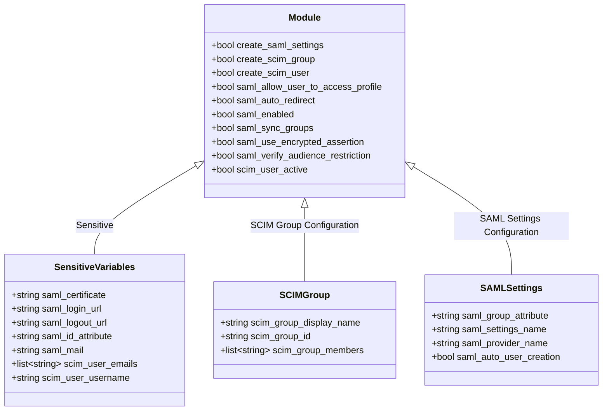

# Terraform Module for JFrog Artifactory Platform SAML+SCIM Settings

[](https://github.com/Richard-Barrett/terraform-artifactory-scim-integration/actions/workflows/iac-codeql.yaml)
[](https://github.com/Richard-Barrett/terraform-artifactory-scim-integration/actions/workflows/terraform_validate.yaml)
[](https://github.com/Richard-Barrett/terraform-artifactory-scim-integration/actions/workflows/tflint.yaml)
[](https://github.com/Richard-Barrett/terraform-artifactory-scim-integration/actions/workflows/trivy.yaml)

This Terraform configuration manages resources for JFrog's platform, allowing optional creation of SAML settings, SCIM groups, and SCIM users. Each resource can be toggled independently, providing flexibility in deployment.

## CICD Implementations

Below is an example of a CICD Implementation using BitBucket to call the module and Codefresh to deploy Terraform


## Note

- To see additional notes please see [NOTES](.github/NOTES).

Below you will find a diagram of the overall terraform module

<details>
<summary>Module Diagram</summary>



</details>


WARNING: `THIS IS ONLY AVAILABLE FOR SELF-HOSTED INSTANCES OF ARTIFACTORY!!!`

## Requirements

- **Terraform Version**: >= 1.5.6
- **Required Provider**: `jfrog/platform` version 1.7.4

## Variables

The following variables are used to configure the resources. Boolean variables can be toggled to control which resources are created.

### Resource Toggles

- **`create_saml_settings`** (bool): Toggle creation of the `platform_saml_settings` resource. Default is `false`.
- **`create_scim_group`** (bool): Toggle creation of the `platform_scim_group` resource. Default is `false`.
- **`create_scim_user`** (bool): Toggle creation of the `platform_scim_user` resource. Default is `false`.

### SAML Settings Variables

- **`saml_allow_user_to_access_profile`** (bool): Allow user to access profile.
- **`saml_auto_redirect`** (bool): Automatically redirect SAML requests.
- **`saml_certificate`** (string): Certificate for SAML.
- **`saml_enabled`** (bool): Enable SAML.
- **`saml_group_attribute`** (string): Group attribute for SAML.
- **`saml_id_attribute`** (string): Name ID attribute for SAML.
- **`saml_login_url`** (string): Login URL for SAML.
- **`saml_logout_url`** (string): Logout URL for SAML.
- **`saml_mail`** (string): Email attribute for SAML.
- **`saml_no_auto_user_creation`** (bool): Disable automatic user creation for SAML.
- **`saml_provider_name`** (string): Service provider name for SAML.
- **`saml_settings_name`** (string): Name for the SAML settings.
- **`saml_sync_groups`** (bool): Sync groups for SAML.
- **`saml_use_encrypted_assertion`** (bool): Use encrypted assertion for SAML.
- **`saml_verify_audience_restriction`** (bool): Verify audience restriction for SAML.

### SCIM Group Variables

- **`scim_group_display_name`** (string): Display name for SCIM group.
- **`scim_group_id`** (string): ID for SCIM group.
- **`scim_group_members`** (list(string)): Members of SCIM group.

### SCIM User Variables

- **`scim_user_active`** (bool): Active status for SCIM user.
- **`scim_user_emails`** (list(string)): Emails for SCIM user.
- **`scim_user_username`** (string): Username for SCIM user.

## Usage

1. **Set up your variables**: Define variables in a `.tfvars` file or use environment variables to configure the settings.
2. **Toggle resource creation**: Set the `create_saml_settings`, `create_scim_group`, and `create_scim_user` variables to `true` for each resource you want to create.
3. **Initialize Terraform**:
    ```bash
    terraform init
    ```
4. **Apply the configuration**:
    ```bash
    terraform apply
    ```

## Examples

To create only the SAML settings, the module might look like this:

```hcl
module "jfrog_platform" {
  source = "git::https://github.com/Richard-Barrett/terraform-artifactory-scim-integration.git?ref=0.2.0"

  # Enable only SAML settings
  create_saml_settings = true
  create_scim_group    = false
  create_scim_user     = false

  # Define SAML settings
  saml_enabled                     = true
  saml_settings_name               = "example_saml"
  saml_certificate                 = "CERTIFICATE_STRING_HERE"
  saml_mail                        = "email"
  saml_group_attribute             = "group"
  saml_id_attribute                = "id"
  saml_login_url                   = "https://saml.example.com/login"
  saml_logout_url                  = "https://saml.example.com/logout"
  saml_no_auto_user_creation       = true
  saml_provider_name               = "ExampleProvider"
  saml_allow_user_to_access_profile = true
  saml_auto_redirect               = false
  saml_sync_groups                 = false
  saml_verify_audience_restriction = true
  saml_use_encrypted_assertion     = false
}
```

Or you can specify it with `tf.vars`:

```bash
export TF_VAR_create_saml_settings=true
export TF_VAR_create_scim_group=false
export TF_VAR_create_scim_user=false
export TF_VAR_saml_enabled=true
export TF_VAR_saml_settings_name="example_saml"
export TF_VAR_saml_certificate="CERTIFICATE_STRING_HERE"
export TF_VAR_saml_mail="email"
export TF_VAR_saml_group_attribute="group"
export TF_VAR_saml_id_attribute="id"
export TF_VAR_saml_login_url="https://saml.example.com/login"
export TF_VAR_saml_logout_url="https://saml.example.com/logout"
export TF_VAR_saml_no_auto_user_creation=true
export TF_VAR_saml_provider_name="ExampleProvider"
export TF_VAR_saml_allow_user_to_access_profile=true
export TF_VAR_saml_auto_redirect=false
export TF_VAR_saml_sync_groups=false
export TF_VAR_saml_verify_audience_restriction=true
export TF_VAR_saml_use_encrypted_assertion=false
```

allowing you to specify it with just the following:

```hcl
terraform {
  required_version = ">= 1.5.6"
  required_providers {
    platform = {
      source  = "jfrog/platform"
      version = "1.7.4"
    }
  }
}

provider "platform" {
  # Add provider configuration here if required
}

module "jfrog_platform" {
  source = "git::https://github.com/Richard-Barrett/terraform-artifactory-scim-integration.git?ref=0.2.0"
}
```

You can also specify data resources and read in the `certificate` via AWS Secrets Manager.

### Inputs

<!-- BEGIN_TF_DOCS -->
## Requirements

| Name | Version |
|------|---------|
| <a name="requirement_terraform"></a> [terraform](#requirement\_terraform) | >= 1.5.6 |
| <a name="requirement_platform"></a> [platform](#requirement\_platform) | 1.15.1 |

## Providers

| Name | Version |
|------|---------|
| <a name="provider_platform"></a> [platform](#provider\_platform) | 1.15.1 |

## Modules

No modules.

## Resources

| Name | Type |
|------|------|
| [platform_saml_settings.this](https://registry.terraform.io/providers/jfrog/platform/1.15.1/docs/resources/saml_settings) | resource |
| [platform_scim_group.this](https://registry.terraform.io/providers/jfrog/platform/1.15.1/docs/resources/scim_group) | resource |
| [platform_scim_user.this](https://registry.terraform.io/providers/jfrog/platform/1.15.1/docs/resources/scim_user) | resource |

## Inputs

| Name | Description | Type | Default | Required |
|------|-------------|------|---------|:--------:|
| <a name="input_create_saml_settings"></a> [create\_saml\_settings](#input\_create\_saml\_settings) | n/a | `bool` | `false` | no |
| <a name="input_create_scim_group"></a> [create\_scim\_group](#input\_create\_scim\_group) | n/a | `bool` | `false` | no |
| <a name="input_create_scim_user"></a> [create\_scim\_user](#input\_create\_scim\_user) | n/a | `bool` | `false` | no |
| <a name="input_saml_allow_user_to_access_profile"></a> [saml\_allow\_user\_to\_access\_profile](#input\_saml\_allow\_user\_to\_access\_profile) | Allow user to access profile | `bool` | `false` | no |
| <a name="input_saml_auto_redirect"></a> [saml\_auto\_redirect](#input\_saml\_auto\_redirect) | Automatically redirect SAML requests | `bool` | `true` | no |
| <a name="input_saml_auto_user_creation"></a> [saml\_auto\_user\_creation](#input\_saml\_auto\_user\_creation) | Disable automatic user creation for SAML | `bool` | `true` | no |
| <a name="input_saml_certificate"></a> [saml\_certificate](#input\_saml\_certificate) | Certificate for SAML | `string` | n/a | yes |
| <a name="input_saml_enabled"></a> [saml\_enabled](#input\_saml\_enabled) | Enable SAML | `bool` | `true` | no |
| <a name="input_saml_group_attribute"></a> [saml\_group\_attribute](#input\_saml\_group\_attribute) | Group attribute for SAML | `string` | n/a | yes |
| <a name="input_saml_id_attribute"></a> [saml\_id\_attribute](#input\_saml\_id\_attribute) | Name ID attribute for SAML | `string` | n/a | yes |
| <a name="input_saml_login_url"></a> [saml\_login\_url](#input\_saml\_login\_url) | Login URL for SAML | `string` | n/a | yes |
| <a name="input_saml_logout_url"></a> [saml\_logout\_url](#input\_saml\_logout\_url) | Logout URL for SAML | `string` | n/a | yes |
| <a name="input_saml_mail"></a> [saml\_mail](#input\_saml\_mail) | Email attribute for SAML | `string` | `""` | no |
| <a name="input_saml_provider_name"></a> [saml\_provider\_name](#input\_saml\_provider\_name) | Service provider name for SAML | `string` | n/a | yes |
| <a name="input_saml_settings_name"></a> [saml\_settings\_name](#input\_saml\_settings\_name) | Name for the SAML settings | `string` | n/a | yes |
| <a name="input_saml_sync_groups"></a> [saml\_sync\_groups](#input\_saml\_sync\_groups) | Sync groups for SAML | `bool` | `true` | no |
| <a name="input_saml_use_encrypted_assertion"></a> [saml\_use\_encrypted\_assertion](#input\_saml\_use\_encrypted\_assertion) | Use encrypted assertion for SAML | `bool` | `false` | no |
| <a name="input_saml_verify_audience_restriction"></a> [saml\_verify\_audience\_restriction](#input\_saml\_verify\_audience\_restriction) | Verify audience restriction for SAML | `bool` | `true` | no |
| <a name="input_scim_group_display_name"></a> [scim\_group\_display\_name](#input\_scim\_group\_display\_name) | Display name for SCIM group | `string` | `null` | no |
| <a name="input_scim_group_id"></a> [scim\_group\_id](#input\_scim\_group\_id) | ID for SCIM group | `string` | `null` | no |
| <a name="input_scim_group_members"></a> [scim\_group\_members](#input\_scim\_group\_members) | List of members for SCIM group, each with 'value', 'type', and 'display' fields. | <pre>list(object({<br>    value   = string<br>    type    = string<br>    display = string<br>  }))</pre> | `[]` | no |
| <a name="input_scim_user_active"></a> [scim\_user\_active](#input\_scim\_user\_active) | Active status for SCIM user | `bool` | `false` | no |
| <a name="input_scim_user_emails"></a> [scim\_user\_emails](#input\_scim\_user\_emails) | List of email objects for SCIM user, each with 'value', 'type', and 'primary' fields. | <pre>list(object({<br>    value   = string<br>    type    = string<br>    primary = bool<br>  }))</pre> | `[]` | no |
| <a name="input_scim_user_username"></a> [scim\_user\_username](#input\_scim\_user\_username) | Username for SCIM user | `string` | `null` | no |

## Outputs

| Name | Description |
|------|-------------|
| <a name="output_saml_login_url"></a> [saml\_login\_url](#output\_saml\_login\_url) | The login URL for SAML |
| <a name="output_saml_logout_url"></a> [saml\_logout\_url](#output\_saml\_logout\_url) | The logout URL for SAML |
| <a name="output_saml_provider_name"></a> [saml\_provider\_name](#output\_saml\_provider\_name) | The service provider name for SAML |
| <a name="output_saml_settings_name"></a> [saml\_settings\_name](#output\_saml\_settings\_name) | The name of the SAML settings resource |
<!-- END_TF_DOCS -->
